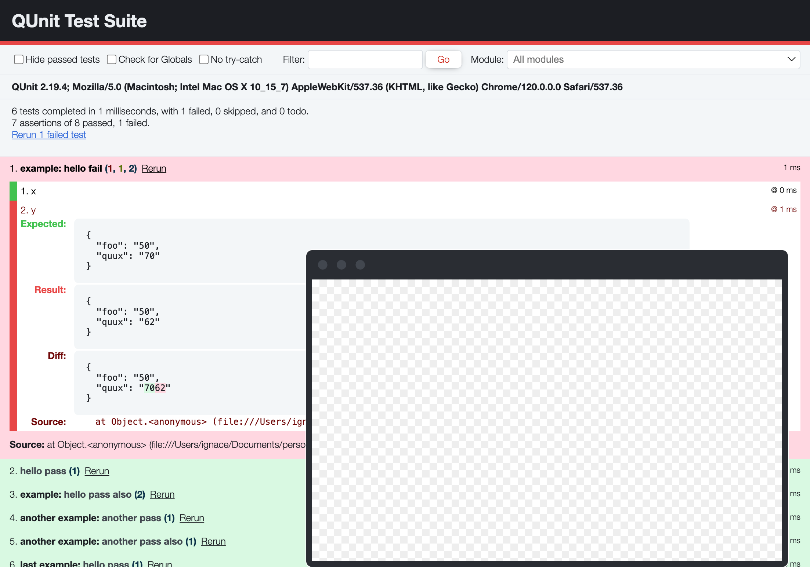

# QUnit Ember Theme

A theme for the QUnit web UI test runner based on the [Ember styleguide](https://github.com/ember-learn/ember-styleguide).



👉 [View the live demo](https://refined-github-html-preview.kidonng.workers.dev/IgnaceMaes/qunit-theme-ember/raw/main/test/index.html)

## Installation

### 1. Install the package

```sh
npm install --save-dev qunit-theme-ember
# or
yarn add --dev qunit-theme-ember
# or
pnpm install --save-dev qunit-theme-ember
```

### 2. Import the theme in your test suite

```js
// your-app/tests/test-helper.js
// ... other imports
import 'qunit-theme-ember/qunit.css';
```

## Contributing

To preview this locally, open the `test/index.html` file in your browser.
